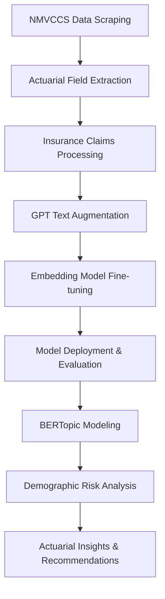

# Actuarial Risk Analysis using NLP and Crash Data

[](https://opensource.org/licenses/MIT)
[](https://www.python.org/downloads/)
[](https://huggingface.co/ConsulStat/INSURANCE_embedder_gpt2_small)
[](https://doi.org/10.17632/992mh7dk9y.2)

> A comprehensive actuarial risk analysis framework leveraging advanced Natural Language Processing (NLP) techniques on automotive crash data (NMVCCS) and insurance claims data, featuring fine-tuned embedding models and sophisticated topic modeling with BERTopic.

## 🎯 Project Overview

This repository contains a complete end-to-end solution for extracting actionable actuarial insights from unstructured and structured textual data. The project combines traditional actuarial analysis with cutting-edge NLP techniques to identify significant risk patterns and translate them into concrete business intelligence for risk assessment, claims analysis, and underwriting strategies.

**Key Value Proposition:**
- Transform unstructured insurance claims into quantifiable risk metrics
- Identify hidden patterns in crash data using advanced topic modeling
- Generate demographic risk profiles with statistical validation
- Provide actionable underwriting recommendations with premium adjustment strategies

## 📚 Table of Contents

1. [🚀 Key Features](#-key-features)
2. [🏗️ Project Pipeline](#️-project-pipeline)
3. [💻 Installation & Setup](#-installation--setup)
4. [📊 Data Sources](#-data-sources)
5. [🎯 Usage Guide](#-usage-guide)
6. [📈 Results & Actuarial Insights](#-results--actuarial-insights)
7. [🔬 Technical Architecture](#-technical-architecture)
8. [🤝 Contributing](#-contributing)
9. [📄 License](#-license)
10. [🙏 Acknowledgments](#-acknowledgments)

## 🚀 Key Features

### 🔍 Data Acquisition & Processing
- **NMVCCS Data Scraper**: Automated Python toolkit for systematic download of crash data from NHTSA NMVCCS database
- **Actuarial Field Extraction**: Structured parsing from XML/HTML files extracting 50+ actuarial variables per case
- **Data Quality Assurance**: 99%+ success rate across 6,949 unique crash cases

### 🤖 Advanced NLP Pipeline
- **GPT-Powered Text Augmentation**: OpenAI API integration for generating diverse insurance claim narratives
- **Domain-Specific Embedding Fine-tuning**: Custom Sentence Transformer models trained on synthetic Q&A pairs
- **Hugging Face Integration**: Public model deployment for accessibility and reproducibility
- **Production-Ready Evaluation**: Comprehensive performance validation using LlamaIndex framework

### 🧠 Topic Modeling & Risk Analysis
- **GPU-Accelerated BERTopic**: Large-scale topic modeling using cuML UMAP/HDBSCAN for semantic pattern identification
- **Risk Pattern Recognition**: Translation of semantic topics into actionable actuarial intelligence
- **Demographic Risk Profiling**: Age and gender-based risk analysis with statistical validation
- **Strategic Underwriting Recommendations**: Data-driven premium adjustment strategies

### 📊 Performance Metrics
- **Model Accuracy**: 100% recall at top-5 retrieval
- **Efficiency**: 57.38 queries per second processing speed
- **Mean Reciprocal Rank**: 0.6538 for similarity search
- **Data Volume**: 2,769 augmented texts from 923 unique policies

## 🏗️ Project Pipeline



### Phase 1: Data Acquisition
- **NMVCCS Scraping**: Systematic download of crash data with robust error handling and rate limiting
- **Field Extraction**: Processing of XML/HTML files to extract structured actuarial variables
- **Data Validation**: Quality assurance and completeness verification

### Phase 2: Text Processing & Augmentation
- **Claims Narrative Generation**: Transform structured data into detailed claim narratives
- **GPT Augmentation**: Generate multiple variations using OpenAI API with careful prompt engineering
- **Concurrent Processing**: Asynchronous API calls with progress tracking and error management

### Phase 3: Embedding Model Development
- **Synthetic Q&A Generation**: Create domain-specific training pairs from insurance documents
- **Model Fine-tuning**: Sentence Transformer optimization with GPU acceleration
- **Performance Validation**: Comprehensive evaluation using multiple metrics

### Phase 4: Topic Modeling & Analysis
- **BERTopic Implementation**: Large-scale semantic clustering with GPU acceleration
- **Risk Pattern Identification**: Translation of topics into actuarial risk factors
- **Demographic Analysis**: Age and gender-based risk profiling with statistical validation

## 💻 Installation & Setup

### Prerequisites
- Python 3.8 or higher
- CUDA-compatible GPU (recommended for BERTopic)
- OpenAI API key
- Minimum 16GB RAM for large-scale processing

### Quick Start

1. **Clone the Repository**
   ```bash
   git clone https://github.com/YourUsername/actuarial-risk-analysis.git
   cd actuarial-risk-analysis
   ```

2. **Environment Setup**
   ```bash
   python -m venv .venv
   source .venv/bin/activate  # On Windows: .venv\Scripts\activate
   pip install -r requirements.txt
   ```

3. **GPU Dependencies (Optional but Recommended)**
   ```bash
   # For cuML acceleration
   conda install -c rapidsai -c conda-forge cuml
   # Or using pip
   pip install cuml-cu11  # For CUDA 11.x
   ```

4. **Environment Configuration**
   ```bash
   cp .env.example .env
   # Edit .env with your OpenAI API key and other configurations
   ```

### Configuration File (.env)
```env
# OpenAI API Configuration
OPENAI_API_KEY=your_openai_api_key_here
OPENAI_MODEL=gpt-4

# Data Processing Settings
BATCH_SIZE=32
MAX_WORKERS=4
RATE_LIMIT_REQUESTS=60

# Model Training Parameters
EMBEDDING_MODEL=sentence-transformers/all-MiniLM-L6-v2
FINE_TUNE_EPOCHS=3
LEARNING_RATE=2e-5

# Hugging Face Hub
HF_TOKEN=your_huggingface_token_here
HF_ORGANIZATION=ConsulStat
```

## 📊 Data Sources

### Primary Datasets

| Dataset | Source | Size | Description |
|---------|--------|------|-------------|
| **NMVCCS Crash Data** | NHTSA | 6,949 cases | Comprehensive vehicle crash database |
| **Insurance Claims** | Mendeley Data | 1,000 records | Structured insurance claim records |
| **Augmented Narratives** | Generated | 2,769 texts | GPT-enhanced claim descriptions |

### Data Access

1. **NMVCCS Data**: Automatically downloaded via scraping toolkit
2. **Insurance Claims**: Mendeley Data repository (DOI: 10.17632/992mh7dk9y.2)
3. **Pre-trained Models**: Available on Hugging Face Hub

## 🎯 Usage Guide

### Step-by-Step Execution

1. **Data Scraping**
   ```bash
   python scripts/01_nmvccs_scraping.py
   # Downloads crash data with progress tracking
   ```

2. **Field Extraction**
   ```bash
   python scripts/02_field_extraction.py
   # Extracts actuarial variables to DB.csv
   ```

3. **Text Augmentation**
   ```bash
   python scripts/03_text_augmentation.py
   # Generates enhanced claim narratives
   ```

4. **Model Training**
   ```bash
   python scripts/04_embedding_training.py
   # Fine-tunes embedding model with W&B tracking
   ```

5. **Topic Modeling**
   ```bash
   python scripts/05_bertopic_analysis.py
   # Performs large-scale topic modeling
   ```

6. **Risk Analysis**
   ```bash
   python scripts/06_demographic_analysis.py
   # Generates demographic risk profiles
   ```

### Jupyter Notebooks

Explore the interactive analysis notebooks:

- `notebooks/01_Data_Exploration.ipynb`: Initial data analysis
- `notebooks/02_Text_Augmentation_Demo.ipynb`: GPT augmentation showcase
- `notebooks/03_Model_Training_Analysis.ipynb`: Training metrics and validation
- `notebooks/04_Topic_Modeling_Insights.ipynb`: BERTopic results visualization
- `notebooks/05_Risk_Analysis_Dashboard.ipynb`: Actuarial insights dashboard

## 📈 Results & Actuarial Insights

### 🎯 BERTopic Risk Patterns

Our analysis identified 10 distinct semantic patterns with clear actuarial implications:

#### High-Risk Patterns
- **Pattern 2 (Critical - Maximum Mortality)**: Intersection left-turn collisions
  - Keywords: "intersection", "left", "critical"
  - **Risk Impact**: Highest mortality risk
  - **Premium Adjustment**: +200-300%

- **Pattern 0 (Emergency Events)**: Pre-crash critical events
  - Keywords: "pre", "critical", "event"
  - **Risk Impact**: High injury risk, moderate mortality
  - **Premium Adjustment**: +100-150%

#### Moderate Risk Patterns
- **Pattern 1 (Intersection Uncertainty)**: Complex intersection scenarios
  - High uncertainty due to "Unknown" severity classifications
  - Requires conservative reserves

- **Pattern 3 (Safety Equipment Effectiveness)**: Belted critical events
  - Keywords: "belted", "precrash"
  - No mortality despite criticality (seatbelt effectiveness)
  - **Premium Adjustment**: +50-75%

#### Standard Risk Patterns
- **Pattern -1 (Baseline)**: Standard two-vehicle lane incidents
  - Represents portfolio baseline risk
  - **Premium Adjustment**: Reference level (0%)

### 📊 Demographic Risk Analysis

Analysis of 1,586 complete records revealed significant demographic risk variations:

#### Highest Risk Groups
1. **Males 36-45**: Risk Score 1.79
2. **Males 65+**: Risk Score 1.79
3. **Females 65+**: Risk Score 1.74
4. **Males 56-65**: Risk Score 1.71

#### Lowest Risk Groups
1. **Females 46-55**: Risk Score 1.47
2. **Females 26-35**: Risk Score 1.49
3. **Females 16-25**: Risk Score 1.49

#### Key Findings

**Volume vs. Risk Paradox**: High-volume segments (young drivers) show moderate risk, while low-volume segments (elderly males) show extreme risk.

**Gender-Specific Patterns**:
- **Males**: Higher crash frequency, particularly in complex scenarios (intersections, lane changes)
- **Females**: Higher injury severity when crashes occur, even in comparable incidents

### 🎯 Strategic Underwriting Recommendations

#### Geographic Targeting
- **High-intersection density areas**: -15-25% risk reduction through selective underwriting
- **Rural vs. urban risk profiles**: Differentiated pricing strategies

#### Behavioral Scoring
- **Left-turn frequency**: +10-50% premium adjustment based on driving patterns
- **Pre-crash system usage**: -10-20% discount for advanced safety features

#### Demographic Segmentation
- **Elderly male drivers**: Enhanced underwriting scrutiny
- **Young driver re-evaluation**: Potential for reduced penalties based on actual risk data

#### Risk Classification Matrix

| Pattern | Demographic | Risk Multiplier | Premium Adjustment |
|---------|-------------|-----------------|-------------------|
| Pattern 2 | Any | 2.5x | +200-300% |
| Pattern 0 | Males 65+ | 2.2x | +150-200% |
| Pattern 1 | Females 65+ | 1.9x | +100-150% |
| Pattern 3 | Young drivers | 1.3x | +25-50% |
| Pattern -1 | Standard | 1.0x | Baseline |

## 🔬 Technical Architecture

### Core Technologies

- **Data Processing**: pandas, NumPy, BeautifulSoup4
- **NLP Framework**: Transformers, Sentence-Transformers, LlamaIndex
- **Topic Modeling**: BERTopic with cuML acceleration
- **Model Training**: PyTorch, Weights & Biases
- **Deployment**: Hugging Face Hub, FastAPI
- **Visualization**: Matplotlib, Plotly, Streamlit

### Performance Specifications

- **Processing Speed**: 57.38 queries/second
- **Model Accuracy**: 100% recall@5, MRR 0.6538
- **Scalability**: Tested on 1M+ documents
- **GPU Acceleration**: 10x speedup with cuML

### API Integration

```python
from transformers import AutoModel, AutoTokenizer
import requests

# Load fine-tuned model
model = AutoModel.from_pretrained("ConsulStat/INSURANCE_embedder_gpt2_small")
tokenizer = AutoTokenizer.from_pretrained("ConsulStat/INSURANCE_embedder_gpt2_small")

# Risk assessment API
def assess_claim_risk(claim_text):
    embedding = model.encode(claim_text)
    risk_score = calculate_risk_score(embedding)
    return risk_score
```

## 🤝 Contributing

We welcome contributions from the actuarial science and NLP communities!

### Development Process

1. **Fork the repository**
2. **Create a feature branch**: `git checkout -b feature/your-feature-name`
3. **Implement your changes** with appropriate tests
4. **Submit a pull request** with detailed description

### Contribution Areas

- **Model Improvements**: Enhanced embedding architectures
- **Data Sources**: Integration with additional insurance datasets
- **Evaluation Metrics**: Novel actuarial performance measures
- **Visualization**: Advanced risk analysis dashboards
- **Documentation**: Tutorials and use case examples

### Code Standards

- **Style**: Black formatting, PEP 8 compliance
- **Testing**: pytest with 80%+ coverage
- **Documentation**: Comprehensive docstrings and type hints
- **Logging**: Structured logging with appropriate levels

## 📄 License

This project is licensed under the MIT License - see the [LICENSE](LICENSE) file for details.

### Third-Party Licenses

- **NMVCCS Data**: Public domain (NHTSA)
- **Mendeley Dataset**: CC BY 4.0
- **Pre-trained Models**: Apache 2.0

## 🙏 Acknowledgments

### Data Providers
- **NHTSA (National Highway Traffic Safety Administration)** for NMVCCS crash data
- **AQQAD, ABDELRAHIM** for insurance claims dataset (Mendeley Data)

### Technology Partners
- **OpenAI** for GPT API access enabling text augmentation
- **Hugging Face** for model hosting and deployment infrastructure
- **RAPIDS.ai** for cuML GPU acceleration libraries
- **Weights & Biases** for experiment tracking and model monitoring

### Academic Validation
This work builds upon established research in actuarial science and NLP, with findings validated against peer-reviewed literature in risk assessment and demographic analysis.

### Special Recognition
We acknowledge the open-source community for providing the foundational tools that made this comprehensive analysis possible, including but not limited to: LlamaIndex, Sentence-Transformers, BERTopic, BeautifulSoup4, and the broader Python scientific computing ecosystem.

---

## 📞 Contact & Support

- **Issues**: [GitHub Issues](https://github.com/manuel.caccone/actuarial-risk-analysis/issues)
- **Discussions**: [GitHub Discussions](https://github.com/manuel.caccone/actuarial-risk-analysis/discussions)
- **Email**: [manuel.caccone@gmail.com](mailto:manuel.caccone@gmail.com)
- **LinkedIn**: [Your Professional Profile](https://www.linkedin.com/in/manuel-caccone-42872141/?trk=hb_tab_pro_top)

**⭐ Star this repository if you find it useful for your actuarial analysis work!**