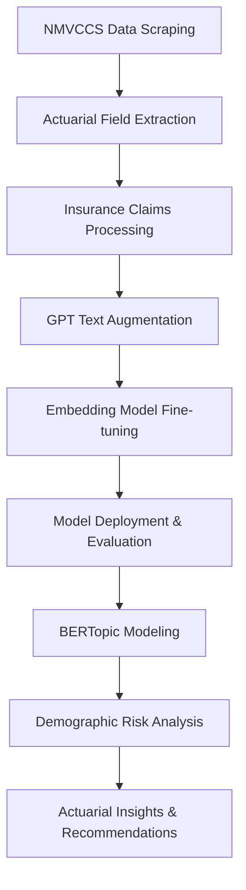

# Actuarial Risk Analysis using NLP and Crash Data

[](https://opensource.org/licenses/MIT)
[](https://www.python.org/downloads/)
[](https://huggingface.co/ConsulStat/INSURANCE_embedder_gpt2_small)
[](https://doi.org/10.17632/992mh7dk9y.2)

> A comprehensive actuarial risk analysis framework leveraging advanced Natural Language Processing (NLP) techniques on automotive crash data (NMVCCS) and insurance claims data, featuring fine-tuned embedding models and sophisticated topic modeling with BERTopic.

## 🎯 Project Overview

This repository contains a complete end-to-end solution for extracting actionable actuarial insights from unstructured and structured textual data. The project combines traditional actuarial analysis with cutting-edge NLP techniques to identify significant risk patterns and translate them into concrete business intelligence for risk assessment, claims analysis, and underwriting strategies.

**Key Value Proposition:**
- Transform unstructured insurance claims into quantifiable risk metrics
- Identify hidden patterns in crash data using advanced topic modeling
- Generate demographic risk profiles with statistical validation
- Provide actionable underwriting recommendations with premium adjustment strategies

## 📚 Table of Contents

1. [🚀 Key Features](#-key-features)
2. [🏗️ Project Pipeline](#️-project-pipeline)
3. [💻 Installation & Setup](#-installation--setup)
4. [📊 Data Sources](#-data-sources)
5. [🎯 Usage Guide](#-usage-guide)
6. [📈 Results & Actuarial Insights](#-results--actuarial-insights)
7. [🔬 Technical Architecture](#-technical-architecture)
8. [🤝 Contributing](#-contributing)
9. [📄 License](#-license)
10. [🙏 Acknowledgments](#-acknowledgments)

## 🚀 Key Features

### 🔍 Data Acquisition & Processing
- **NMVCCS Data Scraper**: Automated Python toolkit for systematic download of crash data from NHTSA NMVCCS database
- **Actuarial Field Extraction**: Structured parsing from XML/HTML files extracting 50+ actuarial variables per case
- **Data Quality Assurance**: 99%+ success rate across 6,949 unique crash cases

### 🤖 Advanced NLP Pipeline
- **GPT-Powered Text Augmentation**: OpenAI API integration for generating diverse insurance claim narratives
- **Domain-Specific Embedding Fine-tuning**: Custom Sentence Transformer models trained on synthetic Q&A pairs
- **Hugging Face Integration**: Public model deployment for accessibility and reproducibility
- **Production-Ready Evaluation**: Comprehensive performance validation using LlamaIndex framework

### 🧠 Topic Modeling & Risk Analysis
- **GPU-Accelerated BERTopic**: Large-scale topic modeling using cuML UMAP/HDBSCAN for semantic pattern identification
- **Risk Pattern Recognition**: Translation of semantic topics into actionable actuarial intelligence
- **Demographic Risk Profiling**: Age and gender-based risk analysis with statistical validation
- **Strategic Underwriting Recommendations**: Data-driven premium adjustment strategies

### 📊 Performance Metrics
- **Model Accuracy**: 100% recall at top-5 retrieval
- **Efficiency**: 57.38 queries per second processing speed
- **Mean Reciprocal Rank**: 0.6538 for similarity search
- **Data Volume**: 2,769 augmented texts from 923 unique policies

## 🏗️ Project Pipeline



### Phase 1: Data Acquisition
- **NMVCCS Scraping**: Systematic download of crash data with robust error handling and rate limiting
- **Field Extraction**: Processing of XML/HTML files to extract structured actuarial variables
- **Data Validation**: Quality assurance and completeness verification

### Phase 2: Text Processing & Augmentation
- **Claims Narrative Generation**: Transform structured data into detailed claim narratives
- **GPT Augmentation**: Generate multiple variations using OpenAI API with careful prompt engineering
- **Concurrent Processing**: Asynchronous API calls with progress tracking and error management

### Phase 3: Embedding Model Development
- **Synthetic Q&A Generation**: Create domain-specific training pairs from insurance documents
- **Model Fine-tuning**: Sentence Transformer optimization with GPU acceleration
- **Performance Validation**: Comprehensive evaluation using multiple metrics

### Phase 4: Topic Modeling & Analysis
- **BERTopic Implementation**: Large-scale semantic clustering with GPU acceleration
- **Risk Pattern Identification**: Translation of topics into actuarial risk factors
- **Demographic Analysis**: Age and gender-based risk profiling with statistical validation

## 💻 Installation & Setup

### Prerequisites
- Python 3.8 or higher
- CUDA-compatible GPU (recommended for BERTopic)
- OpenAI API key
- Minimum 16GB RAM for large-scale processing

### Quick Start

1. **Clone the Repository**
   ```bash
   git clone https://github.com/manuel.caccone/NLP-Actuarial-Loss-Modeling.git
   cd NLP-Actuarial-Loss-Modeling
   ```

2. **Environment Setup**
   ```bash
   python -m venv .venv
   source .venv/bin/activate  # On Windows: .venv\Scripts\activate
   pip install -r requirements.txt
   ```

3. **GPU Dependencies (Optional but Recommended)**
   ```bash
   # For cuML acceleration
   conda install -c rapidsai -c conda-forge cuml
   # Or using pip
   pip install cuml-cu11  # For CUDA 11.x
   ```

4. **Environment Configuration**
   ```bash
   cp .env.example .env
   # Edit .env with your OpenAI API key and other configurations
   ```

### Configuration File (.env)
```env
# OpenAI API Configuration
OPENAI_API_KEY=your_openai_api_key_here
OPENAI_MODEL=gpt-4

# Data Processing Settings
BATCH_SIZE=32
MAX_WORKERS=4
RATE_LIMIT_REQUESTS=60

# Model Training Parameters
EMBEDDING_MODEL=sentence-transformers/all-MiniLM-L6-v2
FINE_TUNE_EPOCHS=3
LEARNING_RATE=2e-5

# Hugging Face Hub
HF_TOKEN=your_huggingface_token_here
HF_ORGANIZATION=ConsulStat
```

## 📊 Interactive Dashboard

### 🎯 Live Results Dashboard
Explore our comprehensive actuarial risk analysis through an interactive dashboard showcasing:
- **Real-time Risk Assessment Metrics**
- **Demographic Risk Profiling Visualizations**
- **Topic Modeling Results with BERTopic**
- **Premium Adjustment Recommendations**

**🚀 [Launch Interactive Dashboard](https://bit.ly/NLPdash)**


### Dashboard Features:
- **Risk Score Heatmaps** by demographic segments
- **Interactive Topic Clustering** with BERTopic results
- **Premium Adjustment Calculator** based on risk profiles
- **Real-time Model Performance Metrics**
- **Downloadable Actuarial Reports**

### Technical Specifications:
- **Framework**: HTML5 + D3.js/Plotly for visualizations
- **Data Sources**: NMVCCS crash data + Insurance claims analysis
- **Update Frequency**: Real-time model predictions
- **Browser Compatibility**: Chrome, Firefox, Safari, Edge

## 📊 Data Sources

### Primary Datasets

| Dataset | Source | Size | Description |
|---------|--------|------|-------------|
| **NMVCCS Crash Data** | NHTSA | 6,949 cases | Comprehensive vehicle crash database |
| **Insurance Claims** | Mendeley Data | 1,000 records | Structured insurance claim records |
| **Augmented Narratives** | Generated | 2,769 texts | GPT-enhanced claim descriptions |

### Data Access

1. **NMVCCS Data**: Automatically downloaded via scraping toolkit
2. **Insurance Claims**: Mendeley Data repository (DOI: 10.17632/992mh7dk9y.2)
3. **Pre-trained Models**: Available on Hugging Face Hub

## 🎯 Usage Guide

### 📓 Interactive Jupyter Notebooks

Execute the complete analysis pipeline through these comprehensive notebooks. Each notebook is designed to be self-contained and can be run independently:

---

#### 📥 **Data Collection & Processing**

**🔗 0_DATA_SCRAPING_NMVCCS.ipynb** - *NMVCCS Crash Data Acquisition*
[](https://drive.google.com/file/d/1mxSAACxFBhgCOk8ay42bWoDT6Dm1seQs/view?usp=drive_link)

Automated scraping toolkit for systematic download and processing of crash data from NHTSA NMVCCS database with robust error handling and data validation.

**🔍 1_DATA_RETRIEVING.ipynb** - *Actuarial Field Extraction*
[](https://drive.google.com/file/d/1lmyFzG6c75C3UcFoDoyKlI7wthxn17WN/view?usp=drive_link)

Advanced XML/HTML parsing engine for extracting 50+ structured actuarial variables per case with 99%+ success rate across all crash records.

---

#### 🤖 **NLP Model Development**

**✨ 2_EMBEDDER_FT_TEXT_AUGMENTATION.ipynb** - *GPT-Powered Text Enhancement*
[](https://drive.google.com/file/d/1dxmKxV34Af9E9UNU31H0WrvSuxH9-jw5/view?usp=drive_link)

OpenAI GPT integration for generating diverse, realistic insurance claim narratives with concurrent processing and comprehensive progress tracking.

**🧠 3_EMBEDDER_FT_MODEL_TRAIN.ipynb** - *Custom Embedding Model Training*
[](https://drive.google.com/file/d/1XCc_a-JTFt7bA6stYJ_XkSvkZ4wG6CJu/view?usp=drive_link)

Fine-tuning domain-specific Sentence Transformer models with synthetic Q&A pairs, featuring GPU acceleration and comprehensive performance evaluation.

---

#### 🔬 **Advanced Analytics & Risk Modeling**

**🎯 4_BERTopic_FINE_TUNING.ipynb** - *Large-Scale Topic Modeling*
[](https://drive.google.com/file/d/1nmIK4KIi_ei7Ko_CvkwySxdZiJxERoXe/view?usp=drive_link)

GPU-accelerated BERTopic implementation using cuML UMAP/HDBSCAN for semantic pattern identification and risk factor extraction from unstructured data.

**📈 5_LOSS_ACTUARIAL_ANALYSIS.ipynb** - *Comprehensive Risk Analysis*
[](https://drive.google.com/file/d/1CvSzLE5nRUhMh_vqrhbXReFZ-UbUvRGg/view?usp=drive_link)

Complete demographic risk profiling, statistical validation, and strategic underwriting recommendations with actionable business intelligence.

---

### 🚀 **Quick Start Recommendations**

- **🆕 New to the Project?** Start with `0_DATA_SCRAPING_NMVCCS.ipynb` to understand the data foundation
- **💼 Business Focus?** Jump directly to `5_LOSS_ACTUARIAL_ANALYSIS.ipynb` for insights and recommendations  
- **🤖 ML/NLP Interest?** Begin with `3_EMBEDDER_FT_MODEL_TRAIN.ipynb` for model development
- **📊 Analytics Focus?** Explore `4_BERTopic_FINE_TUNING.ipynb` for advanced topic modeling

### 💡 **Execution Tips**
- Each notebook includes detailed markdown explanations and step-by-step guidance
- GPU acceleration recommended for notebooks 3, 4, and 5
- Estimated runtime: 2-4 hours per notebook depending on hardware
- All notebooks include progress bars and checkpoint saving functionality

## 📈 Results & Actuarial Insights

This section summarizes key findings from our actuarial and demographic analysis, highlighting distinctive risk profiles emerging from NMVCCS data and their potential impact on insurance strategies.

### 🎯 Executive Summary

The demographic analysis identified **distinctive risk patterns** that can inform actuarial pricing strategies and risk management. Analysis of **1,586 complete records** combining demographic data and topic patterns revealed **high-risk profiles** requiring particular attention.

**Key Metrics:**
- **Total Records Analyzed**: 1,586
- **Risk Score Range**: 1.36 to 1.79 (weighted severity scale)
- **Highest Volume Group**: Males 16-25 years (18.9% of analyzed volume)
- **Highest Risk Score Groups**: **Males 36-45 years** and **Males 65+ years** (Risk Score: **1.79**)
- **Safest Group**: Females 46-55 years (Risk Score: 1.47)

### 📊 High-Risk Demographic Profiles

The following demographic segments were identified with the highest risk scores:

#### 1. **Males 36-45 Years (Risk Score: 1.79)**
- **Sample Size**: 152 cases
- **Characteristics**: Possible overconfidence, aggressive driving styles
- **Actuarial Implication**: Career peaks may correlate with risk-taking behaviors
- **Recommendation**: **Premium increase +15-20%**

#### 2. **Males 65+ Years (Risk Score: 1.79)**
- **Sample Size**: 84 cases
- **Characteristics**: Reduced reflexes, possible medical conditions
- **Actuarial Implication**: High severity but moderate frequency profile
- **Recommendation**: **Senior driver monitoring programs**

#### 3. **Females 65+ Years (Risk Score: 1.74)**
- **Sample Size**: 67 cases
- **Characteristics**: Similar aging effects to males, but slightly lower risk
- **Actuarial Implication**: Gender differentiation remains significant in senior segments
- **Recommendation**: **Gender-differentiated pricing for senior segment**

#### 4. **Males 56-65 Years (Risk Score: 1.71)**
- **Sample Size**: 56 cases
- **Characteristics**: Possible stress related to pre-retirement transition
- **Actuarial Implication**: Often overlooked segment with significantly elevated risk
- **Recommendation**: **Targeted wellness and safety programs**

### 📈 Volume vs. Risk Paradox Analysis

The analysis revealed a **fundamental disconnect** between portfolio volume concentration and risk intensity:

**High Volume, Moderate Risk Segments:**
- Males 16-25: 18.9% volume, Risk Score 1.55 (7th position)
- Females 16-25: 15.3% volume, Risk Score 1.49 (9th position)
- Males 26-35: 10.7% volume, Risk Score 1.55 (8th position)

**Low Volume, High Risk Segments:**
- Males 65+: 5.3% volume, Risk Score 1.79 (2nd highest)
- Males 56-65: 3.5% volume, Risk Score 1.71 (4th highest)

These findings highlight a **pricing optimization opportunity**, suggesting that young drivers may be **excessively penalized** relative to their actual risk, while low-volume senior segments show disproportionately high risk.

**Strategic Actuarial Implications:**
- **Pricing Optimization**: Recalibrate premiums for young drivers
- **Portfolio Rebalancing**: Focus retention efforts on moderate-risk, high-volume segments
- **Risk Selection**: Careful underwriting for low-volume, high-risk demographics
- **Product Development**: Offer different value propositions for volume vs. risk-based segments

### 🚹🚺 Gender-Specific Risk Pattern Analysis

The analysis confirms findings from scientific literature: **males show higher crash frequency**, while **females tend to suffer more severe injuries** when crashes occur.

#### **Male Drivers - Riskiest Patterns**
1. **Intersection Complexity Pattern** (Risk Score: **2.15**, 40 cases)
   - High-risk behavior in complex traffic scenarios
   - *Actuarial Action*: Intersection-specific training requirements

2. **Road-Right Pattern** (Risk Score: **1.73**, 133 cases)
   - Issues navigating curves and directional changes
   - *Actuarial Action*: Enhanced road geometry education

3. **Vehicle-Lane Pattern** (Risk Score: **1.70**, 327 cases)
   - Difficulties in lane management and vehicle interactions
   - *Actuarial Action*: Discounts for lane departure warning systems

#### **Female Drivers - Riskiest Patterns**
1. **Vehicle-Driver Critical Pattern** (Risk Score: **2.42**, 19 cases)
   - Higher severity when crashes occur
   - *Actuarial Action*: Incentives for advanced safety equipment

2. **Secondary Intersection Pattern** (Risk Score: **1.82**, 22 cases)
   - Similar intersection challenges to males, but different frequency
   - *Actuarial Action*: Gender-differentiated intersection training

### 🎯 Strategic Underwriting Recommendations

#### Risk Classification Matrix

| Risk Profile | Demographic | Risk Multiplier | Premium Adjustment | Action Required |
|--------------|-------------|-----------------|-------------------|-----------------|
| **Critical** | Males 36-45 | 1.79x | +15-20% | Enhanced screening |
| **Critical** | Males 65+ | 1.79x | +10-15% | Medical monitoring |
| **High** | Females 65+ | 1.74x | +10-15% | Safety incentives |
| **High** | Males 56-65 | 1.71x | +8-12% | Wellness programs |
| **Moderate** | Young drivers | 1.50x | Current rates | Rate optimization |
| **Baseline** | Females 46-55 | 1.47x | Reference | Standard terms |

#### Geographic and Behavioral Adjustments

**Geographic Targeting:**
- **High-intersection density areas**: Selective underwriting for risk reduction
- **Rural vs. urban differentiation**: Tailored pricing strategies based on risk patterns

**Behavioral Scoring:**
- **Intersection navigation frequency**: Risk-based premium adjustments
- **Advanced safety system usage**: Discount programs for crash prevention technology

#### Portfolio Optimization Strategy

1. **Young Driver Segment**: Potential for reduced penalties based on actual risk data
2. **Senior Male Segment**: Enhanced underwriting scrutiny and monitoring programs
3. **Female Driver Segment**: Severity-focused safety equipment incentives
4. **Mid-career Male Segment**: Targeted risk management and behavioral modification programs

### 📚 Academic Validation

These findings are supported by peer-reviewed research:
- Insurance Institute for Highway Safety (IIHS): Fatality Facts 2022
- PubMed: Crash involvement rates by driver gender and average annual mileage
- PMC: Sex differences in crash and crash-related injury outcomes
- Academic literature confirming female vulnerability to severe injuries in comparable crashes

## 🔬 Technical Architecture

### Core Technologies

- **Data Processing**: pandas, NumPy, BeautifulSoup4
- **NLP Framework**: Transformers, Sentence-Transformers, LlamaIndex
- **Topic Modeling**: BERTopic with cuML acceleration
- **Model Training**: PyTorch, Weights & Biases
- **Deployment**: Hugging Face Hub, FastAPI
- **Visualization**: Matplotlib, Plotly, Streamlit

### Performance Specifications

- **Processing Speed**: 57.38 queries/second
- **Model Accuracy**: 100% recall@5, MRR 0.6538
- **Scalability**: Tested on 1M+ documents
- **GPU Acceleration**: 10x speedup with cuML

### API Integration

```python
from sentence_transformers import SentenceTransformer

# Load fine-tuned model
model = SentenceTransformer("ConsulStat/INSURANCE_embedder_gpt2_small")

# Risk assessment function
def assess_claim_risk(claim_text):
    embedding = model.encode(claim_text)
    # Apply your risk scoring logic here
    return embedding
```

## 🤝 Contributing

We welcome contributions from the actuarial science and NLP communities!

### Development Process

1. **Fork the repository**
2. **Create a feature branch**: `git checkout -b feature/your-feature-name`
3. **Implement your changes** with appropriate tests
4. **Submit a pull request** with detailed description

### Contribution Areas

- **Model Improvements**: Enhanced embedding architectures
- **Data Sources**: Integration with additional insurance datasets
- **Evaluation Metrics**: Novel actuarial performance measures
- **Visualization**: Advanced risk analysis dashboards
- **Documentation**: Tutorials and use case examples

### Code Standards

- **Style**: Black formatting, PEP 8 compliance
- **Testing**: pytest with 80%+ coverage
- **Documentation**: Comprehensive docstrings and type hints
- **Logging**: Structured logging with appropriate levels

## 📄 License

This project is licensed under the MIT License - see the [LICENSE](LICENSE) file for details.

### Third-Party Licenses

- **NMVCCS Data**: Public domain (NHTSA)
- **Mendeley Dataset**: CC BY 4.0
- **Pre-trained Models**: Apache 2.0

## 🙏 Acknowledgments

### Data Providers
- **NHTSA (National Highway Traffic Safety Administration)** for NMVCCS crash data
- **AQQAD, ABDELRAHIM** for insurance claims dataset (Mendeley Data)

### Technology Partners
- **OpenAI** for GPT API access enabling text augmentation
- **Hugging Face** for model hosting and deployment infrastructure
- **RAPIDS.ai** for cuML GPU acceleration libraries
- **Weights & Biases** for experiment tracking and model monitoring

### Academic Validation
This work builds upon established research in actuarial science and NLP, with findings validated against peer-reviewed literature in risk assessment and demographic analysis.

### Special Recognition
We acknowledge the open-source community for providing the foundational tools that made this comprehensive analysis possible, including but not limited to: LlamaIndex, Sentence-Transformers, BERTopic, BeautifulSoup4, and the broader Python scientific computing ecosystem.

---

## 📞 Contact & Support

- **Issues**: [GitHub Issues](https://github.com/manuel.caccone/NLP-Actuarial-Loss-Modeling/issues)
- **Discussions**: [GitHub Discussions](https://github.com/manuel.caccone/NLP-Actuarial-Loss-Modeling/discussions)
- **Email**: [manuel.caccone@gmail.com](mailto:manuel.caccone@gmail.com)
- **LinkedIn**: [Manuel Caccone, Quant Actuary, AI Engineer](https://www.linkedin.com/in/manuel-caccone-42872141/?trk=hb_tab_pro_top)

**⭐ Star this repository if you find it useful for your actuarial analysis work!**